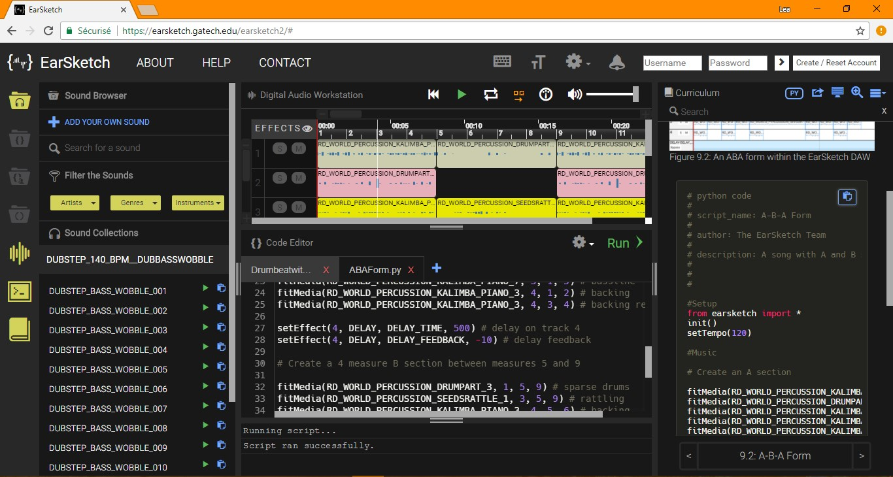

# EarSketch
[EarSketch](https://earsketch.gatech.edu/) is a web application for learning Python / JavaScript programming through the process of creating music. This NSF-funded research is led by Jason Freeman (my thesis advisor) and Brian Magerko. I have contributed as a front-end developer for about 7 years (!) with also some backend (Java / MySQL, Linux server) duties. My notable works may be: (1) the re-architecting and migration of AngularJS / RequireJS client codebase (150k LOC) to a React / Redux / Webpack-based one, (2) a collaborative editor implementing the [operational transformation](https://en.wikipedia.org/wiki/Operational_transformation), (3) a precise audio scheduling engine for live coding, and (4) an [NTP](http://www.ntp.org/)-based playback synchronization between multiple clients. This project has turned me into a JavaScript ninja but also let me create some memory leaks in the Java backend (crushing the production), which is a milestone as a developer in my humble estimate.

<iframe title="vimeo-player" src="https://player.vimeo.com/video/180510371" width="640" height="400" frameborder="0" allowfullscreen></iframe>